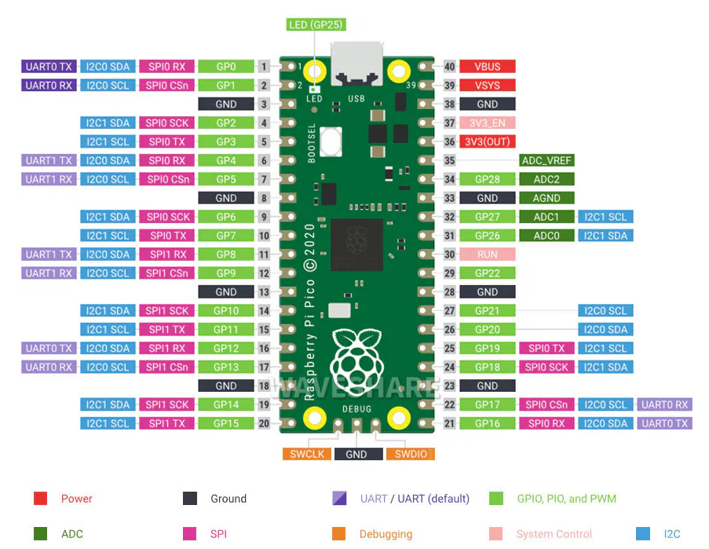
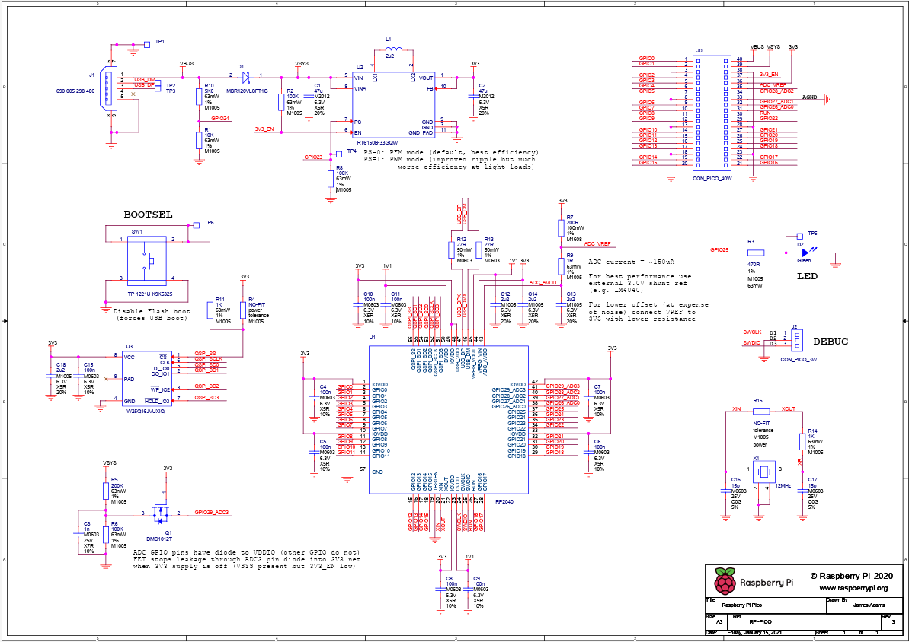

## 簡介
Raspberry Pi Pico 是一款樹莓派官方設計的低成本，高性能的微控制器開發板，具有靈活數位接口。  
硬體上，採用Raspberry Pi 官方自主研發的RP2040 微控制器晶片，搭載了ARM Cortex M0 + 雙核處理器，高達133MHz 的運行頻率，內置了264KB 的SRAM 和2MB 的內存，還板載有多達26 個多功能的GPIO 引腳。  
軟體上，可選擇樹莓派提供的C/C++ SDK，或者使用Micro Python 進行開發，且配套有完善的開發資料教程，可方便快速入門開發，並嵌入應用到產品中。

## 規格
- 採用了Raspberry Pi 官方自主設計的RP2040 微控制器晶片
- 搭載了雙核ARM Cortex M0 + 處理器，運行頻率高達133MHz震盪器
- 內置了264KB 的SRAM 和2MB 的Flash
- 郵票孔設計，可直接焊接到用戶自主設計的底板上
- USB1.1 主機和設備支持
- 支持低功耗睡眠和休眠模式
- 可通過USB 識別為大容量存儲器進行拖放式下載程式
- 多達26 個多功能的GPIO 引腳
- 2 個SPI，2 個I2C，2 個UART，3 個12 位元ADC，16 個可控PWM 通道
- 精確的時鐘和定時器
- 溫度感測器
- 加速浮點庫
- 8 個可編程I/O (PIO) 狀態機，用於自定義外設支持

  (Pico 腳位圖)  

 (Pico 線路圖)

